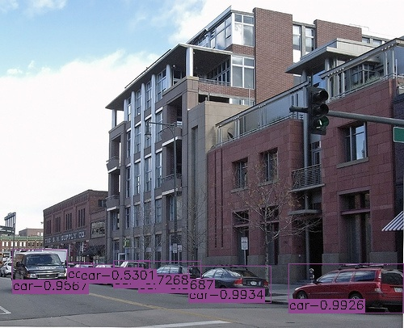
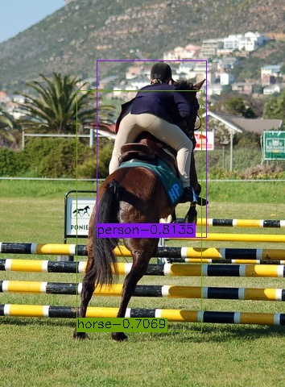
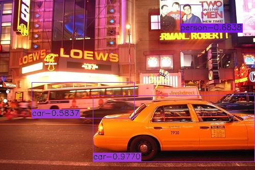

# EfficientDet
This is an implementation of [EfficientDet](https://arxiv.org/pdf/1911.09070.pdf) for object detection on Keras and Tensorflow. The project is based on [fizyr/keras-retinanet](https://github.com/fizyr/keras-retinanet)
and the [qubvel/efficientnet](https://github.com/qubvel/efficientnet). 
The pretrained EfficientNet weights files are downloaded from [Callidior/keras-applications/releases](https://github.com/Callidior/keras-applications/releases)

Thanks for their hard work.
This project is released under the Apache License. Please take their licenses into consideration too when use this project.

## Train
### build dataset 
1. Pascal VOC 
    * Download VOC2007 and VOC2012, copy all image files from VOC2007 to VOC2012.
    * Append VOC2007 train.txt to VOC2012 trainval.txt.
    * Overwrite VOC2012 val.txt by VOC2007 val.txt.
2. MSCOCO 2017
    * Download images and annotations of coco 2017
    * Copy all images into datasets/coco/images, all annotations into datasets/coco/annotations
3. Other types please refer to [fizyr/keras-retinanet](https://github.com/fizyr/keras-retinanet))
### train
* STEP1: `python3 train.py --snapshot imagenet --phi {0, 1, 2, 3, 4, 5, 6} --gpu 0 --random-transform --compute-val-loss --freeze-backbone --batch-size 32 --steps 1000 pascal|coco datasets/VOC2012|datasets/coco` to start training. The init lr is 1e-3.
* STEP2: `python3 train.py --snapshot xxx.h5 --phi {0, 1, 2, 3, 4, 5, 6} --gpu 0 --random-transform --compute-val-loss --freeze-bn --batch-size 4 --steps 10000 pascal|coco datasets/VOC2012|datasets/coco` to start training when val mAP can not increase during STEP1. The init lr is 1e-4 and decays to 1e-5 when val mAP keeps dropping down.
## Evaluate
1. PASCAL VOC
    * `python3 eval/common.py` to evaluate pascal model by specifying model path there.
    * The best evaluation results (score_threshold=0.01, mAP50) on VOC2007 test are: 

    | phi | 0 | 1 |
    | ---- | ---- | ---- |
    | w/o weighted |  | [0.8029](https://drive.google.com/open?id=1-QkMq56w4dZOTQUnbitF53NKEiNF9F_Q) |
    | w/ weighted | [0.7892](https://drive.google.com/open?id=1mrqL9rFoYW-4Jc57MsTipkvOTRy_EGfe) |  |
2. MSCOCO
    * `python3 eval/coco.py` to evaluate coco model by specifying model path there.
## Test
`python3 inference.py` to test your image by specifying image path and model path there. 

 

