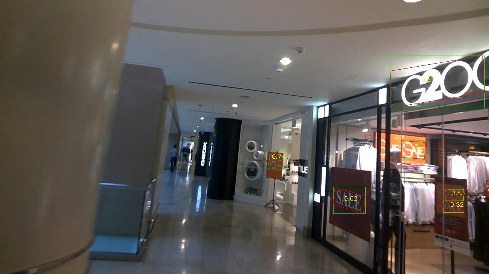

# EfficientDet
This is an implementation of [EfficientDet](https://arxiv.org/pdf/1911.09070.pdf) for object detection on Keras and Tensorflow. The project is based on [fizyr/keras-retinanet](https://github.com/fizyr/keras-retinanet)
and the [qubvel/efficientnet](https://github.com/qubvel/efficientnet). 
The pretrained EfficientNet weights files are downloaded from [Callidior/keras-applications/releases](https://github.com/Callidior/keras-applications/releases)

Thanks for their hard work.
This project is released under the Apache License. Please take their licenses into consideration too when use this project.

## Train
### build dataset (only support csv format) 
The `CSVGenerator` provides an easy way to define your own datasets.
It uses two CSV files: one file containing annotations and one file containing a class name to ID mapping.

#### Annotations format
The CSV file with annotations should contain one annotation per line.
Images with multiple bounding boxes should use one row per bounding box.
Note that indexing for pixel values starts at 0.
The expected format of each line is:
```
path/to/image.jpg,x1,y1,x2,y2,x3,y3,x4,y4,class_name
```
**Note that x1,y1,x2,y2,x3,y3,x4,y4 should be in clockwise order**.

By default the CSV generator will look for images relative to the directory of the annotations file.

Some images may not contain any labeled objects.
To add these images to the dataset as negative examples,
add an annotation where `x1`, `y1`, `x2`, `y2`, `x3`, `y3`, `x4`, `y4` and `class_name` are all empty:
```
path/to/image.jpg,,,,,
```
#### Class mapping format
The class name to ID mapping file should contain one mapping per line.
Each line should use the following format:
```
class_name,id
```

Indexing for classes starts at 0.
Do not include a background class as it is implicit.

For example:
```
cow,0
cat,1
bird,2
```
For text detection:
```
text, 0
```

### train
* STEP1: `python3 train.py --detect-quadrangle [--detect-text] --snapshot imagenet --phi {0, 1, 2, 3, 4, 5, 6} --gpu 0 --random-transform --compute-val-loss --freeze-backbone --batch-size 32 --steps 1000 csv train.csv classes.csv --val-annotations val.csv` to start training. 
The init lr is 1e-3.
* STEP2: `python3 train.py --detect-quadrangle [--detect-text] --snapshot xxx.h5 --phi {0, 1, 2, 3, 4, 5, 6} --gpu 0 --random-transform --compute-val-loss --freeze-bn --batch-size 4 --steps 10000 csv train.csv classes.csv --val-annotations val.csv` to start training when val mAP can not increase during STEP1. 
The init lr is 1e-4 and decays to 1e-5 when val mAP keeps dropping down.

## Test
`python3 inference_quad.py` to test your image by specifying image path and model path there. 
Here I share an immature [model](https://drive.google.com/open?id=1CgbmaMmrbwJnJgS6xQyEVH_5L79NfKpl) trained on ICDAR2015.

 



## Reference
- [《gliding vertex on the horizontal bounding box for multi-oriented object detection》](https://arxiv.org/abs/1911.09358)